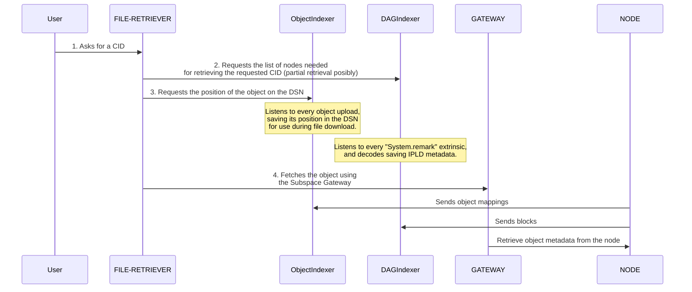

# Auto-Files Gateway

This service is used for retrieving already archived files from the Autonomy's Decentralized Storage Network (DSN). For retrieving files these should be formatted complying the format in [`@autonomys/auto-dag-data`](https://www.npmjs.com/package/@autonomys/auto-dag-data) and files should be already archived.

## FAQs

- **What means a file to be archived?:** When a file is uploaded to Autonomy’s network as a series of transactions, it is not immediately distributed as segmented pieces from which farmers generate storage proofs. There's some variable delay between the transaction submission and the file availability that depends on the network congestion among other factors.

## How it works?

The flow illustrates how a file retrieval is performed in **Files Gateway**:.

- When a **user requests a specific content identifier (CID)**, the **File Retriever** coordinates the process by querying various indexers to obtain both metadata and storage location details.
- The **Object Indexer** and **DAG Indexer** maintain a constantly updated map of where data resides across the network and how it is structured within content-addressable graphs.
- Once the necessary information is gathered, the **Gateway** and participating **Nodes** manage the actual data transfer, retrieving the requested file from the decentralized storage and delivering it back to the user efficiently and securely.
- This coordinated interaction ensures that even though data is stored in a distributed manner, retrieval remains seamless and transparent to the end user.

