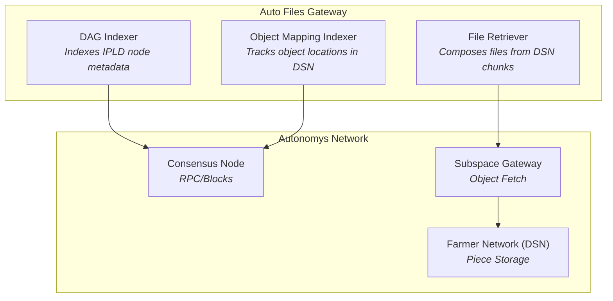
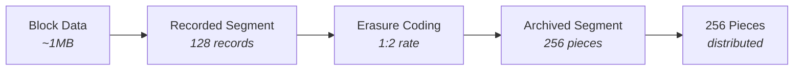
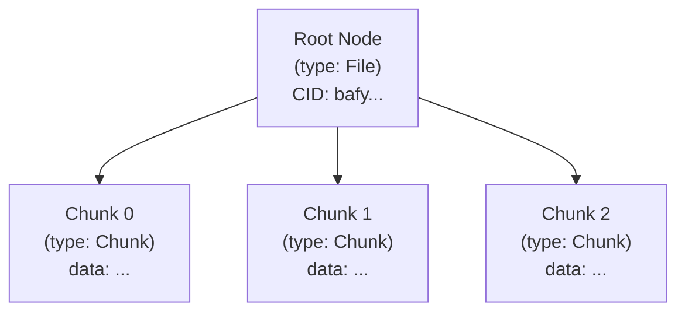
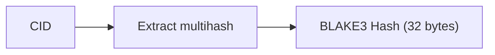
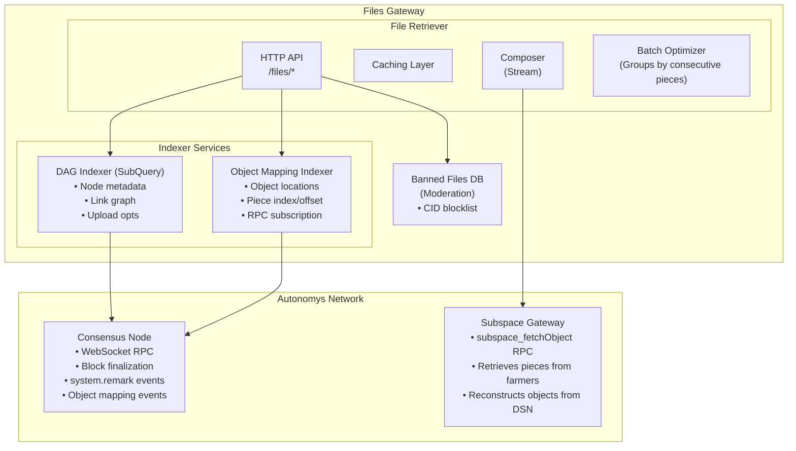
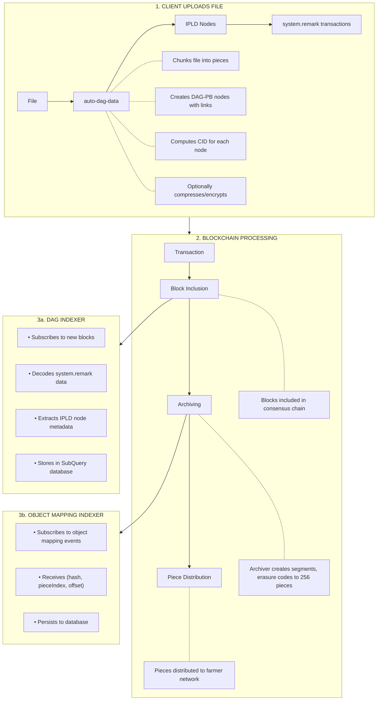
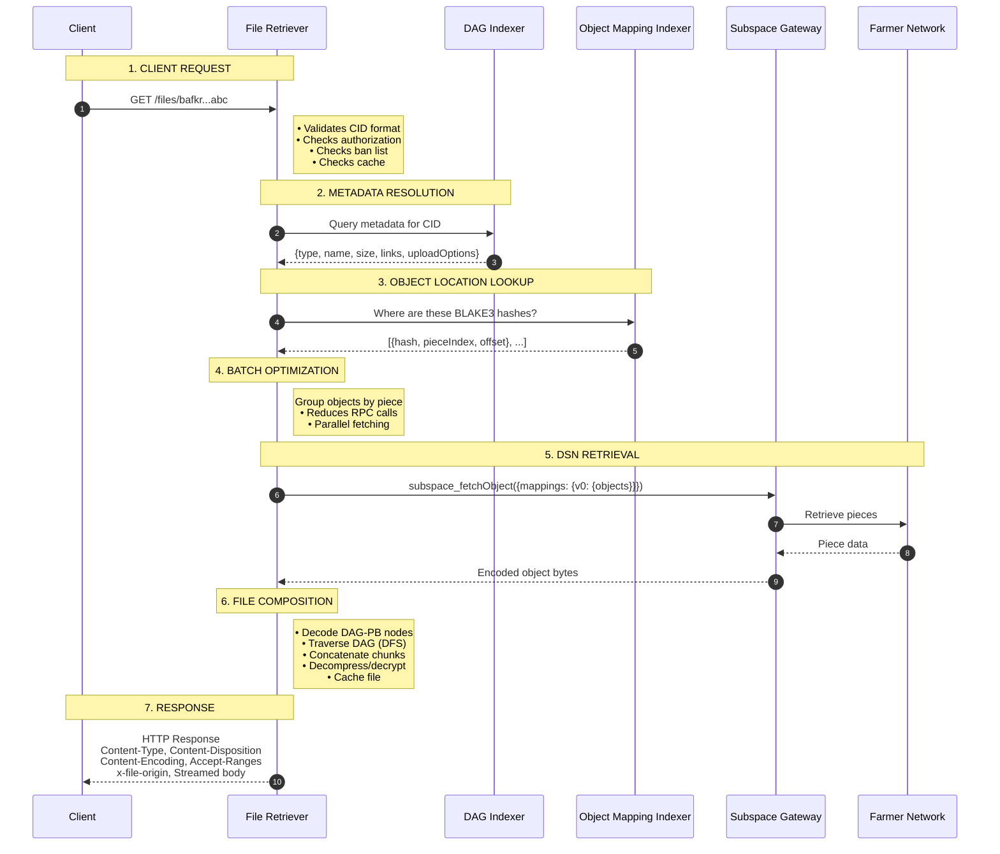

# Files Gateway Architecture

This document provides a comprehensive overview of the Auto Files Gateway architecture, explaining how it integrates with the Autonomys Network to provide decentralized file storage and retrieval.

## Table of Contents

- [Overview](#overview)
- [Autonomys Network Fundamentals](#autonomys-network-fundamentals)
  - [Archiving Process](#archiving-process)
  - [Pieces and Segments](#pieces-and-segments)
  - [Object Mappings](#object-mappings)
- [File Data Structure](#file-data-structure)
  - [IPLD DAG-PB Nodes](#ipld-dag-pb-nodes)
  - [Content Addressing](#content-addressing)
- [System Components](#system-components)
  - [Component Diagram](#component-diagram)
  - [DAG Indexer](#dag-indexer)
  - [Object Mapping Indexer](#object-mapping-indexer)
  - [File Retriever](#file-retriever)
  - [External Dependencies](#external-dependencies)
- [Data Flow](#data-flow)
  - [File Upload Flow](#file-upload-flow)
  - [File Retrieval Flow](#file-retrieval-flow)
- [Key Data Models](#key-data-models)
- [Related Documentation](#related-documentation)

---

## Overview

The Auto Files Gateway is a three-service system that enables efficient file retrieval from the Autonomys Decentralized Storage Network (DSN). It bridges the gap between content-addressed file storage (using IPLD/CIDs) and the Autonomys blockchain's archival storage layer.



## Autonomys Network Fundamentals

Understanding Files Gateway requires familiarity with core Autonomys Network concepts.

### Archiving Process

The Autonomys Network uses a unique archiving process to store blockchain history:

1. **Block Production**: New blocks are produced containing transactions (including file data via `system.remark` extrinsics)
2. **Archiving**: Blocks are archived into **Recorded History Segments** (~1MB each)
3. **Erasure Coding**: Each segment is erasure coded (1:2 rate) producing **Archived History Segments**
4. **Piece Generation**: Each archived segment contains **256 pieces** (~1MB each after encoding)
5. **Distribution**: Pieces are distributed across the farmer network (DSN)



### Pieces and Segments

| Concept                      | Description                                 | Size                          |
| ---------------------------- | ------------------------------------------- | ----------------------------- |
| **Raw Record**               | Pre-archiving data unit                     | ~1MB (2^15 chunks × 31 bytes) |
| **Record**                   | Post-archiving data unit                    | ~1MB (2^15 chunks × 32 bytes) |
| **Piece**                    | Record + Commitment + Witness               | ~1MB                          |
| **Recorded History Segment** | 128 raw records before archiving            | ~128MB                        |
| **Archived History Segment** | 256 pieces after erasure coding             | ~256MB                        |
| **Piece Index**              | Global unique identifier for a piece        | u64                           |
| **Segment Index**            | Identifies which segment a piece belongs to | u64                           |

**Key Formula**: `piece_index = segment_index × 256 + position_in_segment`

### Object Mappings

When data is stored on the network, the system tracks its location through **Object Mappings**:

```typescript
// Object mapping as a tuple: [hash, pieceIndex, pieceOffset]
type ObjectMapping = [string, number, number]

// Wrapped structure received from RPC subscription
type GlobalObjectMapping = {
  blockNumber: number
  v0: {
    objects: ObjectMapping[]
  }
}
```

Object mappings are critical because:

- Files may span multiple pieces
- Direct piece retrieval is efficient (vs. scanning)
- BLAKE3 hashes provide integrity verification

## File Data Structure

### IPLD DAG-PB Nodes

Files are stored using [IPLD](https://ipld.io/) (InterPlanetary Linked Data) with DAG-PB (Directed Acyclic Graph - Protocol Buffers) encoding, implemented via [`@autonomys/auto-dag-data`](https://www.npmjs.com/package/@autonomys/auto-dag-data).



**Node Types** (from `@autonomys/auto-dag-data`):

| Type        | Description                                         |
| ----------- | --------------------------------------------------- |
| `File`      | Root node representing a complete file              |
| `Chunk`     | Leaf node containing raw file data                  |
| `ChunkLink` | Intermediate node for large files (links to chunks) |
| `InLink`    | Reference to another node (deduplication)           |
| `Folder`    | Directory containing file references                |

**IPLD Node Metadata**:

```typescript
interface IPLDNodeData {
  type: MetadataType // File, Chunk, InLink, Folder, etc.
  name?: string // Filename (for File/Folder types)
  size?: number // Total size in bytes
  linkDepth: number // 0 for leaves, max child depth + 1 for parents
  uploadOptions?: {
    compression?: {
      algorithm: 'ZLIB' // Uses DEFLATE internally
      level?: number
    }
    encryption?: {
      algorithm: 'AES_256_GCM'
      chunkSize?: number
    }
  }
}
```

### Content Addressing

Files Gateway uses two types of content addresses:

| Type            | Format                     | Purpose                                        |
| --------------- | -------------------------- | ---------------------------------------------- |
| **CID**         | `bafkr...` (CIDv1, base32) | IPLD content identifier (includes codec, hash) |
| **BLAKE3 Hash** | 32-byte hex                | Used for object mappings in DSN                |

**CID to BLAKE3 Conversion**:



The BLAKE3 hash is derived from the CID and is used to look up object mappings in the DSN.

## System Components

### Component Diagram



### DAG Indexer

**Purpose**: Indexes IPLD node metadata from blockchain events for fast metadata lookups.

**Technology**: [SubQuery](https://subquery.network/) indexer framework

**Data Source**: `system.remark` and `system.remarkWithEvent` extrinsics

**Indexed Data**:

- CID and BLAKE3 hash
- Node type, name, size, link depth
- Block height, hash, timestamp
- Links to child nodes
- Upload options (compression, encryption)

**See**: [DAG Indexer Documentation](./dag-indexer.md)

### Object Mapping Indexer

**Purpose**: Tracks where objects are located within the DSN (piece index + offset).

**Data Source**: `subspace_subscribeObjectMappings` RPC subscription

**Stored Data**:

| hash (BLAKE3) | pieceIndex | pieceOffset | blockNumber |
| ------------- | ---------- | ----------- | ----------- |
| 0x1234...     | 12345      | 0           | 1000000     |

**Features**:

- Real-time subscription to new mappings
- Recovery mode for catching up from a piece index
- HTTP and JSON-RPC/WebSocket APIs

**See**: [Object Mapping Indexer Documentation](./object-mapping-indexer.md)

### File Retriever

**Purpose**: HTTP service that composes files from DSN chunks and serves them to clients.

**Key Features**:

- Content streaming with byte-range support
- Two-layer caching (node cache + file cache)
- Batch optimization (groups objects by piece)
- Moderation (CID ban list)
- Compression/encryption handling

**See**: [File Retriever Documentation](./file-retriever.md)

### External Dependencies

| Dependency           | Purpose                                | Required |
| -------------------- | -------------------------------------- | -------- |
| **Autonomys Node**   | Blockchain RPC for events/metadata     | Yes      |
| **Subspace Gateway** | DSN retrieval (`subspace_fetchObject`) | Yes      |
| **PostgreSQL**       | Storage for indexers                   | Yes      |

**Autonomys Node** provides WebSocket RPC for blockchain subscriptions:

- DAG Indexer subscribes to blocks to index `system.remark` extrinsics
- Object Mapping Indexer subscribes to `subspace_subscribeObjectMappings` to learn where objects landed in the DSN after archiving

**Subspace Gateway** retrieves actual data from the farmer network:

- Exposes `subspace_fetchObject` RPC
- File Retriever uses this to fetch piece data given object mappings
- Internally connects to a node and the DSN

## Data Flow

### File Upload Flow

Files are uploaded via external tools (e.g., Auto Drive SDK), not through Files Gateway. Here's how uploaded files become retrievable:



**Archiving Delay**: There's a variable delay between transaction submission and file availability. Files are only retrievable after:

1. Block inclusion
2. Archiving into a segment (block marked as "finalized")
3. Piece distribution to farmers
4. Object mapping indexing

### File Retrieval Flow



## Key Data Models

### IPLD Node (DAG Indexer)

```typescript
interface IndexedNode {
  // Identifiers
  cid: string // Content identifier (bafkr...)
  blake3Hash: string // 32-byte BLAKE3 hash

  // Blockchain context
  blockHeight: number
  blockHash: string
  extrinsicId: string
  extrinsicHash: string
  indexInBlock: number
  timestamp: Date

  // IPLD metadata
  type: MetadataType // File, Chunk, InLink, Folder, etc.
  name?: string // Filename
  size: number // Total size in bytes
  linkDepth: number // DAG depth (0 for leaves)
  links: string[] // Child CIDs

  // Upload options
  uploadOptions?: {
    compression?: { algorithm: string; level?: number }
    encryption?: { algorithm: string; chunkSize?: number }
  }
}
```

### Object Mapping (Object Mapping Indexer)

```typescript
// Tuple format: [hash, pieceIndex, pieceOffset]
type ObjectMapping = [
  string, // BLAKE3 hash (32 bytes, hex encoded)
  number, // Global piece index in DSN
  number, // Byte offset within the piece
]

// Wrapped structure from RPC subscription
type GlobalObjectMapping = {
  blockNumber: number
  v0: {
    objects: ObjectMapping[]
  }
}
```

### File Cache Entry (File Retriever)

```typescript
// Uses @autonomys/file-server FileResponse type
interface FileResponse {
  data: Readable
  size?: bigint
  mimeType?: string
  filename?: string
  encoding?: string // e.g., 'deflate' for compressed files
}
```

## Related Documentation

| Document                                                                           | Description                            |
| ---------------------------------------------------------------------------------- | -------------------------------------- |
| [Development Guide](./development.md)                                              | Local development setup                |
| [DAG Indexer](./dag-indexer.md)                                                    | DAG Indexer service details            |
| [Object Mapping Indexer](./object-mapping-indexer.md)                              | Object Mapping Indexer service details |
| [File Retriever](./file-retriever.md)                                              | File Retriever service details         |
| [Subspace Protocol](https://github.com/autonomys/subspace)                         | Core protocol implementation           |
| [@autonomys/auto-dag-data](https://www.npmjs.com/package/@autonomys/auto-dag-data) | IPLD data format library               |

---

## Glossary

| Term               | Definition                                                                   |
| ------------------ | ---------------------------------------------------------------------------- |
| **Archiving**      | Process of converting blockchain blocks into pieces for distributed storage  |
| **BLAKE3**         | Fast cryptographic hash function used for object identification in DSN       |
| **CID**            | Content Identifier - self-describing content address (IPFS/IPLD standard)    |
| **DAG-PB**         | Protocol Buffers-based DAG format used for IPLD nodes                        |
| **DSN**            | Decentralized Storage Network - the farmer network storing pieces            |
| **Erasure Coding** | Fault tolerance technique (1:2 ratio) doubling data with parity for recovery |
| **Extrinsic**      | A transaction or call in Substrate-based blockchains                         |
| **Farmer**         | Network participant that stores pieces and generates proofs                  |
| **IPLD**           | InterPlanetary Linked Data - data model for content-addressed structures     |
| **Object Mapping** | Record linking a BLAKE3 hash to its DSN location (pieceIndex + offset)       |
| **Piece**          | ~1MB unit of archived data distributed to farmers                            |
| **Piece Index**    | Global unique identifier for a piece across all segments                     |
| **Raw Record**     | Pre-archiving data unit (~1MB, 31-byte chunks)                               |
| **Record**         | Post-archiving data unit (~1MB, 32-byte chunks)                              |
| **Segment**        | Collection of 256 pieces from archived blockchain history                    |
| **Segment Index**  | Identifies which segment a piece belongs to                                  |
| **SubQuery**       | Indexing framework used by DAG Indexer                                       |
| **system.remark**  | Substrate extrinsic for storing arbitrary data on-chain                      |

---

## Appendix: Size Constants

From the Subspace protocol:

| Constant                                  | Value                  | Notes                                     |
| ----------------------------------------- | ---------------------- | ----------------------------------------- |
| `RawRecord::SIZE`                         | 1,015,808 bytes (~1MB) | 2^15 × 31 bytes                           |
| `Record::SIZE`                            | 1,048,576 bytes (1MB)  | 2^15 × 32 bytes                           |
| `Piece::SIZE`                             | ~1MB                   | Record + Commitment (48B) + Witness (48B) |
| `RecordedHistorySegment::NUM_RAW_RECORDS` | 128                    | Raw records per segment                   |
| `ArchivedHistorySegment::NUM_PIECES`      | 256                    | Pieces per archived segment               |
| `ERASURE_CODING_RATE`                     | 1:2                    | 100% overhead (2x), 50% fault tolerance   |
